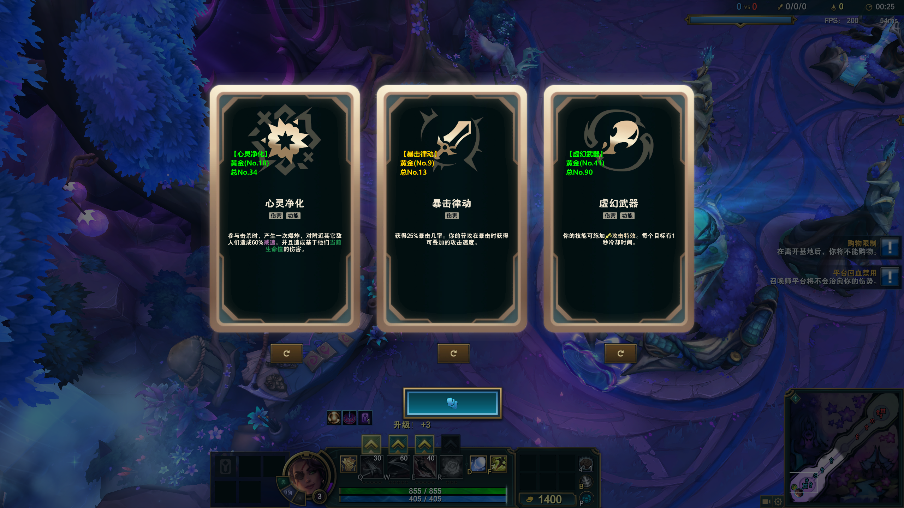

# nho有手就行

## 下载安装包

前往 **[Releases](https://github.com/lixyd/nho-ysjxing/releases)** 下载最新 `nho-ysjxing-windows.zip`：解压后以管理员运行 `ARAMHelper.exe`，游戏请用无边框窗口模式。


**产品名：nho有手就行** — 面向 **极地大乱斗 · 海克斯大乱斗 (ARAM Mayhem)** 的 Windows 本地助手，用 **LCU API + 屏幕 OCR 遮罩** 覆盖日常所需，减少对 LeagueAkari 等工具的依赖。

**不做**：游戏进程注入、内存读写、自动点击游戏窗口。海克斯仅遮罩推荐；符文可通过官方 LCU `lol-perks` 套用。

 <p align="center">
      
      <br>
      <em>图：海克斯识别与颜色提示效果展示（游戏内）</em>
    </p>

## 📚 数据来源说明

| 数据类型 | 来源 |
|----------|------|
| 符文 / 英雄 **ID、名称** | Riot 官方 [Data Dragon](https://ddragon.leagueoflegends.com/) / [Community Dragon](https://www.communitydragon.org/)（联盟静态数据） |
| 大乱斗 **推荐组合统计**（胜率/选用） | **官网不提供**胜率推荐；当前来自对局统计数据集（`@champ-r/u.gg-aram` 等），并已用官网最新 perk ID（Data Dragon `runesReforged`）校验 / 映射 |
| 海克斯胜率 | [OP.GG ARAM Mayhem](https://op.gg/zh-cn/lol/modes/aram-mayhem) 抓取快照 |

本工具仅供学习交流使用。

当前符文库 `_meta.ddragonVersion` 见 `data/aram_runes.json`（构建时拉取最新 Data Dragon 版本）。

---

## ✨ 功能一览

| 开关 | 作用 |
|------|------|
| **自动接受** | 轮询 `/lol-matchmaking/v1/ready-check`，状态为 `InProgress` 等时 `POST .../accept` |
| **自动开始/准备** | 大厅 `PUT /lol-lobby/v1/parties/ready`；可发起 `POST /lol-lobby/v2/lobby/matchmaking/search`；选人阶段尝试 `POST /lol-champ-select/v1/session/my-selection/ready` |
| **自动海克斯识别** | 通过 Live Client (`:2999`) 读取等级，在 **1 / 7 / 11 / 15** 检查点自动 OCR；死亡或检测到 UI 文字时触发；选完后空闲直到下一检查点 |
| **套用符文** | 开启后锁定英雄时自动走 LCU 套用；也可点「套用推荐符文」。数据见 `data/aram_runes.json` |

其它：

* **英雄检测**：复用现有 `LCUConnector`（ChampSelect / GameFlow / Live API）
* **手动「刷新识别」**：界面按钮或 **F6**（不依赖自动流程）
* **无边框友好置顶遮罩**：透明穿透 overlay，始终置顶
* **中文 UI / 中文文档**

热键：**F6** 刷新识别 · **F7** 识别英雄 · **F8** 重置

---

## ⚠️ 前置条件

1. **建议以管理员身份运行**（热键、读取客户端进程/lockfile）
2. 游戏显示模式：**无边框 (Borderless)**
3. 推荐先登录英雄联盟客户端
4. 分辨率自动按主屏相对 2K 缩放，无需手改坐标

---

## 🛠️ Windows 运行方式

### 方式 A：源码运行

```bash
git clone https://github.com/lixyd/nho-ysjxing.git
cd nho-ysjxing

# 推荐 uv + Python 3.12（须 3.9~3.12，rapidocr_onnxruntime 不支持 3.13+）
uv venv --python 3.12
uv pip install -r requirements.txt
uv run python gui_launcher.py

# 或
python -m venv .venv
.venv\Scripts\activate
pip install -r requirements.txt
python gui_launcher.py
```

右键终端 / IDE → **以管理员身份运行**。

### 方式 B：在 Windows 上打包 EXE（须在 Windows 机执行）

> **不要在 Linux 上交叉打包 Windows exe。** 请在本机 Windows + Python 3.9~3.12 下执行：

```bat
cd nho-ysjxing
python -m venv .venv
.venv\Scripts\activate
pip install -r requirements.txt
python build.py
```

产物目录类似：`dist\build_<timestamp>\ARAMHelper\`  
解压/进入后右键 `ARAMHelper.exe` → **以管理员身份运行**。

可选：仅刷新符文数据（需本机构建脚本依赖的 u.gg 提取包时）：

```bat
python scripts\build_aram_runes.py
```

若无法自动连 LCU，请在 `scripts/lcu_connector.py` 的 `COMMON_INSTALL_PATHS` 中加入你的安装路径。

---

## 📂 关键模块

```
gui_launcher.py          # 中文 GUI + 开关 + 托盘（窗口标题：nho有手就行）
main.py                  # DataManager / OCR / Overlay
scripts/lcu_connector.py # LCU + Live Client
scripts/matchmaking.py   # 自动接受 / 准备 / 开始匹配
scripts/auto_hex.py      # 等级检查点自动海克斯
scripts/runes.py         # 符文推荐与 LCU 套用
scripts/build_aram_runes.py  # 自 Data Dragon + 对局统计重建 aram_runes.json
data/aram_runes.json     # 全英雄 ARAM 符文（perk ID 已对齐 DDragon）
data/settings.json       # 开关持久化
data/hero_augments.csv   # 海克斯胜率库
build.py                 # Windows PyInstaller 一键打包
```

### 已实现的 LCU 端点（匹配相关）

| 能力 | 方法 | 路径 |
|------|------|------|
| 查询确认状态 | GET | `/lol-matchmaking/v1/ready-check` |
| 接受确认 | POST | `/lol-matchmaking/v1/ready-check/accept` |
| 组队准备 | PUT | `/lol-lobby/v1/parties/ready` |
| 发起匹配 | POST | `/lol-lobby/v2/lobby/matchmaking/search` |
| 选人准备 | POST | `/lol-champ-select/v1/session/my-selection/ready` |
| 当前符文页 | GET/PUT | `/lol-perks/v1/currentpage` |
| 创建/更新符文 | POST/PUT/DELETE | `/lol-perks/v1/pages`、`/lol-perks/v1/pages/{id}` |
| 局内等级 | GET | `https://127.0.0.1:2999/liveclientdata/activeplayer`（及 playerlist） |

**未做 / 弱化**：自定义房强制开始、自动秒选/秒 ban、完整外网 ARAM 符文库实时同步（当前为本地 JSON + 角色兜底；有 ID 即可套用）。

---

## 🎮 使用流程简述

1. 打开客户端并登录 → 启动 **nho有手就行** → 勾选需要的开关 → **开始识别**
2. 排队时由「自动接受」处理 ready-check；大厅由「自动开始/准备」处理 ready / search
3. 锁定英雄后可查看符文推荐；需要时点「套用推荐符文」或开启自动套用
4. 进入海克斯大乱斗后，等级到 1/7/11/15 会尝试自动 OCR；也可随时 **F6 / 刷新识别**
5. 遮罩金色=最优，绿色=可选，红色=未识别/无数据

---

## 📄 License 与致谢

MIT License。

本仓库基于 [Nyx0ra/lol-aram-mayhem-hextech-helper](https://github.com/Nyx0ra/lol-aram-mayhem-hextech-helper)（MIT，Copyright © Nyx0ra）演进。请保留原作者归属。

符文页统计来自对局数据集并经 Riot Data Dragon 最新 perk ID 校验；欢迎按英雄继续完善 `data/aram_runes.json`。
