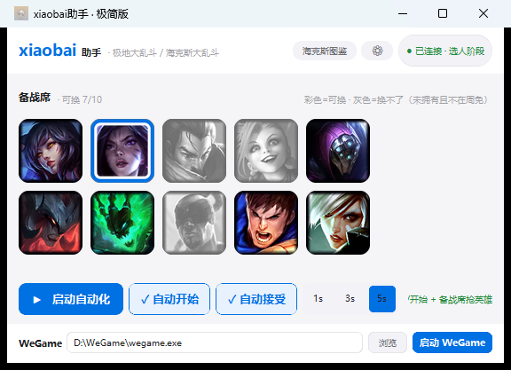
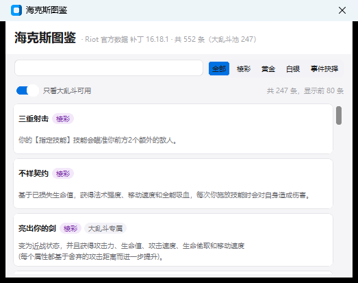
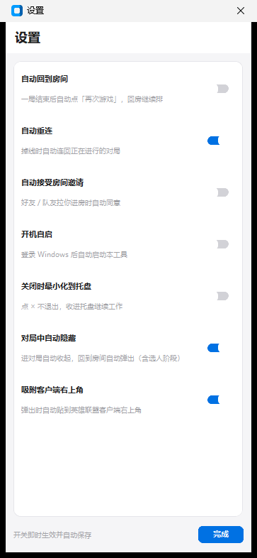

# xiaobai助手 · 极简版

Windows 本地助手，专注 **极地大乱斗 / 海克斯大乱斗（ARAM Mayhem）**。
纯官方 LCU 本地 API 驱动 —— **无进程注入、无内存读写、无键鼠模拟、无 OCR**。

> 官网 / 功能介绍 / 真机截图：**<https://xiaobaiai.asia/xiaobai-helper/>**



界面为浅色 Apple 风格：`#F5F5F7` 底 + 白卡片 + `#0071E3` 强调蓝，
自上而下：英雄墙 → 三个主按钮 → WeGame 栏。整体按 2/3 缩放，窗口约 560×378，
贴客户端右上角时不会挡视野。

---

## 功能

### 匹配自动化
- **`▶ 启动自动化`**：总开关。开启后自动接受对局、自动准备/开始匹配，
  运行中显示 `■ 停止自动化`
- **`开始`**：自动准备 + 开始匹配，点一下立刻试一次
- **`接受`**：自动接受 ready-check，延迟可选 **1s / 3s / 5s**
- **自动回到房间**（设置里开）：结算后自动点「再次游戏」
- **自动重连**：掉线（Reconnect 阶段）自动连回对局
- **自动接受房间邀请**：好友 / 队友拉你进房时自动同意
- **WeGame 一键启动**（界面最底部）：自动探测 `wegame.exe`（常见路径 + 注册表），
  也可手填/浏览，路径记在 `data/settings.json`

### 备战席抢英雄
10 格两排的**头像墙**，头像 100% 铺满、无文字无倒计时：

| 显示 | 含义 |
|---|---|
| 彩色 | 可换（拥有或在周免） |
| 灰色 | 换不了：**未拥有且不在周免** |
| Apple 蓝环 | 当前抢购目标 |

点头像设为目标 → 自动高频尝试，客户端一放行立刻换上。

- **只在真正有备战席时显示**：判据照搬 LeagueAkari ——
  `/lol-champ-select/v1/session` 的 **`benchEnabled`** 为真才渲染。
  没进选人时该接口返回 404，备战席自然是空的，**不靠 gameflow 阶段字符串猜**
- **可换性数据源**：首选客户端官方 `/lol-champ-select/v1/pickable-champion-ids`
  （LeagueAkari 同款），拿不到时用英雄库
  `/lol-champions/v1/inventories/{summonerId}/champions`（拥有 + freeToPlayReward）兜底，
  再拿不到就不置灰 —— **宁缺勿错**
- **抢购接口**：`POST /lol-champ-select/v1/session/bench/swap/{championId}`
- 头像来源：LCU 本地官方资源优先，离线走 Data Dragon CDN，均带磁盘缓存
  （`data/icon_cache/`）

### 海克斯图鉴
右上角「海克斯图鉴」按钮打开。Riot 官方数据（CommunityDragon，随补丁更新）：

- 552 条海克斯的中文效果 + 稀有度（白银 / 黄金 / 棱彩）+ 是否属于大乱斗池
- 支持关键词搜索与稀有度筛选，**离线可用**
- 官方仅 223/552 条有中文描述，缺的如实标注；官方不提供胜率，图鉴不含胜率数据



### 窗口行为（对局中自动隐藏 + 吸附客户端）
两个开关都在设置里，默认开启：

- **对局中自动隐藏**：进入 `GameStart / InProgress / WaitingForStats /
  PreEndOfGame / EndOfGame / Reconnect` 自动收起（收起前会自动备好托盘图标，
  不会出现「窗口消失又没托盘」的情况）；回到 `Lobby / Matchmaking /
  ReadyCheck / ChampSelect` 自动弹出
  - 三态机 `ignore / show / hide` 照搬 LeagueAkari 小窗的 `autoShow`。
    因为本窗口是**主窗口**而非辅助小窗，额外加了一条闸门：
    **客户端没连上（phase 为空）时不动窗口**，否则主窗口会凭空消失
- **吸附客户端右上角**：弹出时自动贴到英雄联盟客户端窗口右上角外侧，
  并夹进显示器工作区（不会跑出屏幕）
  - 算法照搬 LeagueAkari 的 `repositionToAlignLeagueClientUx`：
    `FindWindow("RCLIENT")` 取矩形 → 算贴角坐标 → 夹进 workArea；
    客户端最小化（宽 < 200 且高 < 50）时跳过

### 托盘与自启
- **开机自启**：写 `HKCU\...\Run`，界面状态以注册表实际状态为准
- **关闭时最小化到托盘**：ctypes 自建托盘图标（零依赖），左键显示、右键退出



---

## 下载与运行

- [Releases](https://github.com/lixyd/xiaobai-helper/releases) 下
  `xiaobai-helper-windows.zip` → 解压后**管理员运行** `ARAMHelper.exe`
- 或 Actions → **Build Windows** → Run workflow → Artifacts（保留 14 天）；
  打 `v*` tag 会自动挂到 Release

从源码运行（Python **3.9 – 3.13**，已在 3.12 验证；Windows）：

```bat
git clone https://github.com/lixyd/xiaobai-helper.git
cd xiaobai-helper
python -m venv .venv & .venv\Scripts\activate & pip install -r requirements.txt
python ctk_launcher.py
```

Windows 本机打包：`python build.py` → `dist\build_*\ARAMHelper\`。
**不要在 Linux 上交叉打包 exe。**

使用流程：登录客户端 → 点「启动自动化」→ 进选人后点备战席英雄设为目标。

---

## 实现要点（与 LeagueAkari 对齐）

| 功能 | 判据 / 接口 | 说明 |
|---|---|---|
| 备战席有无 | `session.benchEnabled` | 为假或 session 404 → 不渲染，单一判据 |
| 能否换 | `pickable-champion-ids` | 拿不到时回落英雄库 `owned / freeToPlayReward` |
| 抢英雄 | `POST .../bench/swap/{id}` | 与 LeagueAkari 同接口 |
| 自动回到房间 | `POST /lol-lobby/v2/play-again` | |
| 自动重连 | `POST /lol-gameflow/v1/reconnect` | |
| 自动接受邀请 | `/lol-lobby/v2/received-invitations/.../accept` | |
| 自动显隐 | 三态机 `ignore/show/hide` | 对齐 LA `_watchAuxWindow` |
| 贴客户端 | `FindWindow("RCLIENT")` + workArea 夹取 | 对齐 LA `qS/WS/GS` |

关键代码：

```
ctk_launcher.py            主界面（Design 设计系统 / 自动显隐 / 吸附）
scripts/lcu_connector.py   LCU 连接与本地资源
scripts/matchmaking.py     接受 / 准备 / 开始
scripts/bench_pick.py      备战席抢英雄
scripts/champ_icons.py     英雄头像（LCU 优先 + CDN + 磁盘缓存）
scripts/augments.py        海克斯图鉴（官方离线数据）
scripts/winpos.py          贴客户端定位（LA 算法复刻）
scripts/tray.py            托盘 + 开机自启（ctypes 零依赖）
scripts/wegame.py          WeGame 定位与启动
scripts/config.py          配置持久化
```

## 数据

| 用途 | 文件 | 来源 |
|---|---|---|
| 海克斯图鉴 | `data/augments_official.json` | Riot / Community Dragon（随补丁更新） |
| 海克斯别名 | `data/augment_alias_zh.json` | 同上 |
| 英雄表 | `data/champions.json` | LCU 本地 |
| 拼音映射 | `data/pinyin_map.json` | 内置 |
| 设置 | `data/settings.json` | 本机生成 |

旧版的海克斯 OCR 推荐与符文系统**已移除**（历史版本见 git 历史）。

## 声明

- 仅调用官方 LCU 本地 API，不修改游戏内存、不注入进程、不模拟键鼠、不做 OCR
- 本工具仅供学习交流，请遵守游戏用户协议

MIT · `lixyd/xiaobai-helper`
