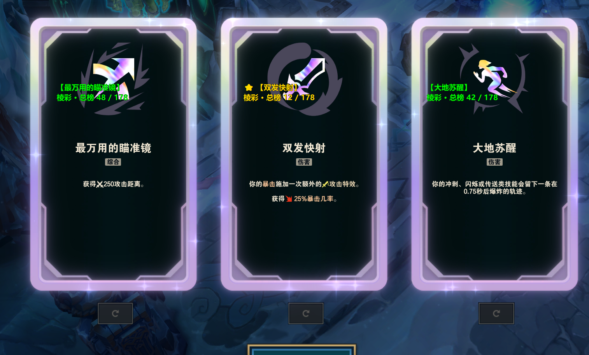

# nho有手就行

Windows 本地助手：极地大乱斗 · 海克斯大乱斗（ARAM Mayhem）。LCU API + OCR 遮罩推荐。

**不做** 进程注入 / 内存读写 / 自动点击游戏窗。符文走官方 LCU `lol-perks`。



## 用

- [Releases](https://github.com/lixyd/nho-ysjxing/releases) 下 `nho-ysjxing-windows.zip` → 管理员运行 `ARAMHelper.exe`，游戏**无边框**。
- 或 Actions → **Build Windows** → Run workflow 下 Artifacts（约 14 天）。打 `v*` tag 会挂到 Release。

源码（Python **3.9–3.12**，rapidocr 不支持 3.13+；管理员终端）：

```bat
git clone https://github.com/lixyd/nho-ysjxing.git
cd nho-ysjxing
python -m venv .venv & .venv\Scripts\activate & pip install -r requirements.txt
python ctk_launcher.py
```

> `ctk_launcher.py` 是 customtkinter 新版 UI（薄荷墨绿配色）；如需回退旧界面，运行 `python gui_launcher.py`。
> 配色预览：直接浏览器打开 `docs/ui_preview.html`，可在三套配色间切换。

Windows 本机打包：`python build.py` → `dist\build_*\ARAMHelper\`。不要在 Linux 交叉打包 exe。

登录客户端 → 开助手 → 勾开关 → **开始识别**。遮罩：金=最优，绿=可选，红=未识别。

## 数据

| 层 | 文件 | 答 | 源 |
|---|---|---|---|
| 识别 | `data/augments_official.json` | 是不是合法海克斯、名、稀有度 | Riot LCU / Community Dragon，不爬 |
| 排名 | `data/hero_augments.csv` | 这英雄排第几 | OP.GG ARAM Mayhem 快照 |
| 符文 | `data/aram_runes.json` | 套哪套 | Data Dragon + `@champ-r/u.gg-aram`，perk ID 已对齐 |

OCR **先认再排**。官方池有、本英雄无排名 →「官方池内 · 本英雄暂无排名」，不退化成未识别。

**坑**

- 国服池必须 `KIWI ∪ KIWI_JADE = 247`（只取 KIWI=223 漏 24）。`CHERRY` 是竞技场，不是 ARAM。
- 海克斯仅 `gameflow=InProgress` 且 Live Client `:2999` 有真实玩家数据才跑；死亡/泉水选牌或 Lv **1/7/11/15**。加载中、大厅、选人不识别（符文套用不受影响）。

构建：`python scripts/build_augments_official.py`；对账 `reconcile_augments.py`；覆盖率 `verify_augment_coverage.py`。启动后每 3 天静默拉 CDragon ~140KB 重建识别层，指纹一致不覆盖。

## 功能

自动接受 ready-check · 大厅准备/开始匹配 · 延迟立即/3/5/10s（默认 5，写入 `data/settings.json`）· 锁定英雄套符文 · 选项刷新 ~0.7s 重推荐。

入口：`ctk_launcher.py`（新版 UI）/ `gui_launcher.py`（旧版 UI + 逻辑层）/ `main.py` / `scripts/{lcu_connector,matchmaking,auto_hex,runes}.py`。

## 更新

| 做什么 | 怎么做 |
|---|---|
| 代码 | push `main` |
| 安装包 | `v*` tag 或 Actions 手动 Build Windows |
| 符文 | GUI「📦 数据更新」/ `python scripts/build_aram_runes.py` / 每周 **Update ARAM Runes** |
| 海克斯 | GUI「数据更新」 |

打赏：GUI「💛 打赏」扫 `assets/donate.jpg`。MIT · `lixyd/nho-ysjxing`。
